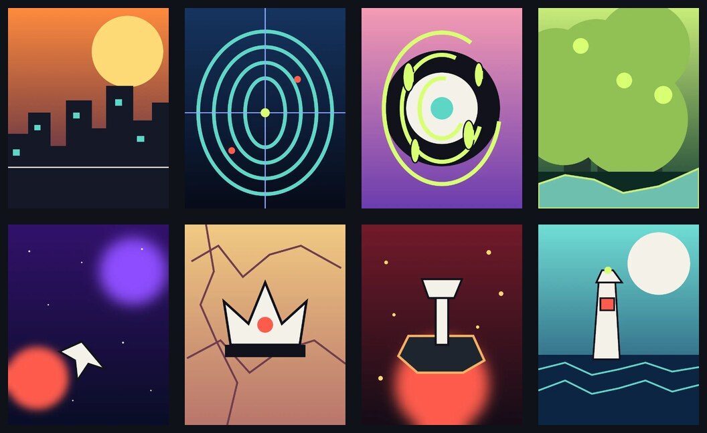

# Arcadia Vault

> Proyecto del Módulo 1 — HTML + CSS + JS · Diplomado Fullstack IPSS

Arcadia Vault es un mini-catálogo editorial de videojuegos independientes ficticios. El sitio permite explorar ocho títulos, buscar y filtrar el catálogo, abrir una vista rápida, revisar una ficha completa y enviar una recomendación mediante un formulario validado con JavaScript.

## Integrantes

- [Nombre y apellido 1]
- [Nombre y apellido 2]
- [Nombre y apellido 3 — eliminar si el grupo es de dos]

> Antes de entregar: reemplazar los nombres entre corchetes y agregar el enlace real del repositorio.

## Demo

- Sitio desplegado: [Agregar URL de GitHub Pages]



## Páginas

- `index.html`: home, hero, carrusel y manifiesto editorial.
- `catalogo.html`: listado, búsqueda, filtro por género y modal de detalle rápido.
- `detalle.html`: ficha completa de Nebula Drift, acordeón y lista de deseos.
- `contacto.html`: formulario con contador, validación y mensaje de confirmación.

## Componentes Bootstrap

1. Navbar responsive con `collapse`.
2. Cards para las fichas del catálogo.
3. Modal para la vista rápida.
4. Carousel para destacados.
5. Accordion en detalle y contacto.
6. Formulario, `input-group`, alert y pagination.

## Eventos JavaScript propios

- Click en el botón de tema: alterna modo claro/oscuro y modifica atributos del documento.
- Click en “Sorpréndeme”: muestra un juego aleatorio en el DOM.
- Input y change en catálogo: filtran las cards y actualizan el contador.
- Click en “Vista rápida”: actualiza el contenido del modal seleccionado.
- Click en “Guardar”: cambia el botón y el mensaje visible.
- Input y submit del formulario: actualizan el contador, validan campos y muestran confirmación.

## Cómo correr localmente

No requiere instalación ni build.

```bash
git clone [URL-DEL-REPOSITORIO]
cd arcadia-vault
python3 -m http.server 8000
```

Luego abrir `http://localhost:8000` en el navegador. También es posible abrir `index.html` directamente.

## Estructura del proyecto

```text
.
├── .github/
│   ├── ISSUE_TEMPLATE/
│   │   └── feature.md
│   └── pull_request_template.md
├── css/
│   └── custom.css
├── docs/
│   └── catalogo-portadas.jpg
├── img/
│   └── [8 portadas WebP optimizadas]
├── js/
│   └── main.js
├── catalogo.html
├── contacto.html
├── detalle.html
├── index.html
├── CHECKLIST-ENTREGA.md
└── README.md
```

## Stack

- HTML5 semántico
- Bootstrap 5.3 vía CDN
- CSS custom mobile first
- JavaScript vanilla
- Google Fonts: Space Grotesk e IBM Plex Mono

## Flujo Git sugerido

Cada integrante debe crear su propia rama `feature/*`, hacer al menos tres commits y abrir un Pull Request hacia `main`. Nadie debe commitear directamente a `main`.

Distribución posible:

- Integrante A: `feature/home-y-detalle`
- Integrante B: `feature/catalogo-y-filtros`
- Integrante C: `feature/contacto-y-documentacion`

Ejemplos de commits:

```text
feat: crear estructura semántica del catálogo
style: personalizar cards y grilla responsive
feat: agregar filtros por nombre y género
```

## Nota sobre las imágenes

Las portadas son composiciones abstractas originales creadas para este proyecto y exportadas en WebP. Los nombres, estudios y videojuegos son ficticios.
